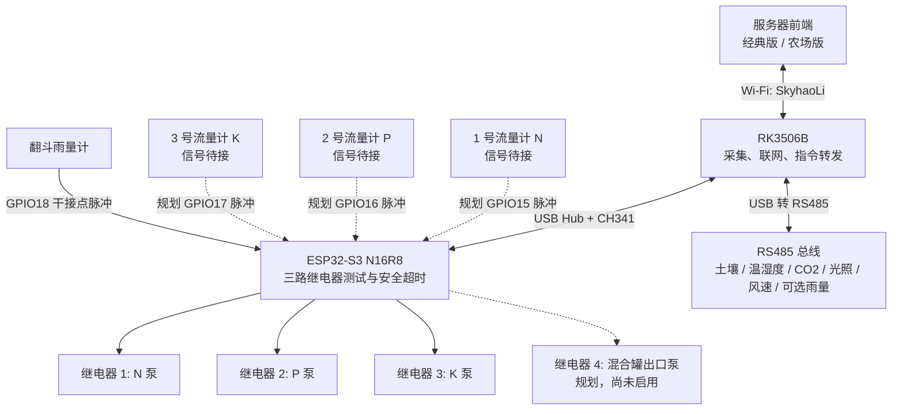

# RK3506B + ESP32-S3 三路肥料泵测试与传感器拓扑

> 当前部署状态（2026-08-27）：IN1/IN2/IN3 分别接 ESP32-S3 GPIO4/5/6，
> 三路继电器均为高电平触发，分别对应 N/P/K 肥料泵。固件、服务器和前端均已启用
> 三路独立测试，上电全部关闭，每路连续运行最长 180 秒。
> 流量计信号线尚未接入，GPIO15/16/17 暂不计数；混合罐出口泵 GPIO7 尚未启用。
> 翻斗雨量传感器仍接 GPIO18 和 GND。

## 当前已启用接线

```text
RK3506B -- USB Hub -- ESP32-S3
                         |-- GPIO4 -> 继电器 IN1 -> N 肥泵（高电平触发）
                         |-- GPIO5 -> 继电器 IN2 -> P 肥泵（高电平触发）
                         |-- GPIO6 -> 继电器 IN3 -> K 肥泵（高电平触发）
                         +-- GPIO18 -> 翻斗雨量计干接点

RK3506B -- USB-RS485 -- 原有环境传感器总线
```

| ESP32-S3 引脚 | 当前连接 | 状态 |
|---|---|---|
| GPIO4 | 继电器 IN1 输入，控制 N 肥泵 | 已启用，高电平触发 |
| GPIO5 | 继电器 IN2 输入，控制 P 肥泵 | 已启用，高电平触发 |
| GPIO6 | 继电器 IN3 输入，控制 K 肥泵 | 已启用，高电平触发 |
| GPIO18 | 翻斗雨量计干接点，另一端接 GND | 已启用，0.3 mm/次 |
| GPIO7 | 混合罐出口泵规划 | 当前固件未启用 |
| GPIO15/16/17 | 三路流量计规划 | 当前固件未启用，信号线待接 |

## 系统拓扑



## 液路拓扑

```text
N 肥罐 -> 1 号流量计 -> N 泵 -> 混合罐
P 肥罐 -> 2 号流量计 -> P 泵 -> 混合罐
K 肥罐 -> 3 号流量计 -> K 泵 -> 混合罐
                                      |
                                      +-> 混合罐出口泵 -> 灌溉主管
```

当前 N/P/K 三组可分别启停，也可同时运行；每路 180 秒后强制停止。流量闭环和三路投料完成后自动启动出口泵属于下一阶段，接入流量计信号及 GPIO7 后再启用。

## ESP32-S3 接线表

| ESP32-S3 引脚 | 连接 | 功能 |
|---|---|---|
| GPIO4 | 四路继电器 IN1 | N 肥泵 |
| GPIO5 | 四路继电器 IN2 | P 肥泵 |
| GPIO6 | 四路继电器 IN3 | K 肥泵 |
| GPIO7 | 四路继电器 IN4 | 混合罐出口泵，规划未启用 |
| GPIO15 | 1 号流量计脉冲输出 | N 肥累计流量，信号待接 |
| GPIO16 | 2 号流量计脉冲输出 | P 肥累计流量，信号待接 |
| GPIO17 | 3 号流量计脉冲输出 | K 肥累计流量，信号待接 |
| GPIO18 | 翻斗雨量计干接点 | 默认 0.3 mm/次 |
| GND | 继电器控制侧、流量计信号侧 GND | 共地 |
| UART0 / CH341 | RK3506B USB Hub | JSON 命令和 `STATE` 状态 |

GPIO25 在 ESP32-S3 上不可用，GPIO26–37 可被 N16R8 的 Flash/PSRAM 占用，新固件不再使用旧的 25/26/27/33 引脚表。

## 流量计电气要求

- ESP32-S3 GPIO 只允许 3.3 V 信号。5 V/12 V 脉冲输出必须通过光耦、三极管开漏或合适的电平转换模块。
- 默认标定值为 `450 pulses/L`，只是初始值。每只流量计必须用实际容器分别标定。
- 当前测试固件尚未读取流量脉冲，不能按流量自动停泵；每路只按 180 秒上限保护。
- 后续泵与流量计的“同时启停”指泵开启时同步进入该表的计量阶段；流量计本身不由继电器断电。

## 雨量计

默认使用翻斗雨量计：干接点两线分别接 GPIO18 和 GND，固件启用内部上拉与 50 ms 消抖。如果使用 RS485 雨量传感器，则并入现有 A/B 总线，并在 `/etc/zhirun-rk3506.env` 设置：

```ini
ZHIRUN_RAIN_ADDR=6
ZHIRUN_RAIN_REG=0
ZHIRUN_RAIN_FUNCTION=3
ZHIRUN_RAIN_SCALE=0.1
```

当 RS485 雨量计没有回应时，RK3506B 自动使用 ESP32 GPIO18 上报的 `rainMm`。

## 安全要求

1. ESP32 GPIO 只接继电器模块的低压控制输入，不能直接泵或接触器线圈。
2. 泵电源回路使用合适额定电流的接触器、空开、漏保和保险，并保留物理急停。
3. 流量计、传感器和控制电源与泵的强电电源分开布线。
4. 首次通电前断开泵的主电源，先逐路验证三路继电器极性和 GPIO 对应关系，再进行小体积标定。
